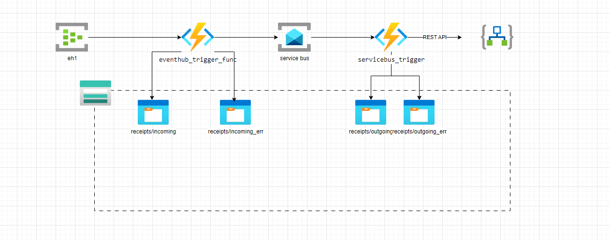

# Table of Contents
1. [Azure Functions Project](#azure-functions-project)
2. [TODO](#todo)
3. [Advantages of the solution](#advantages-of-the-solution)
4. [Disadvantages of the solution](#disadvantages-of-the-solution)
5. [Settings](#settings)
6. [Sample data](#sample-data)
7. [EventHubTriggerFunction](#eventhubtriggerfunction)
8. [Setup](#setup)
9. [Local Development](#local-development)
10. [Sample functions not relevant in project](#sample-functions-not-relevant-in-project)
    - [HttpFunction1](#httpfunction1)
    - [HttpFunction2](#httpfunction2)
    - [BlobTriggerFunction](#blobtriggerfunction)

# Azure Functions Project

This project contains Azure Functions implemented in Python. The functions are designed to handle HTTP requests, Blob storage triggers, and Event Hub messages.

Simplified architecture:




## TODO

* Implement error handling to store error responses in `receipts/incoming_err` and `receipts/outgoing_err`.
* Implement the Storage SDK to store receipts in Blob storage with dynamic names, e.g., `2025012912332102231.json`.
* complete documentation about creating resources


## Advantages of the solution

The solution is highly configurable. Incoming JSON receipts can be described using a JSON schema, which can be stored in the function application settings. This allows for easy updates to the input schema by simply changing the configuration, without requiring costly development efforts.

Possible configurations include:
* Input and output JSON schemas
* Naming conventions for archived blobs in the storage account
* URLs of REST APIs
* 

## Disadvantages of the solution

One limitation of the solution is that the Blob storage output functionality does not allow for flexible naming of blobs. To implement different naming conventions, the Azure Storage SDK must be used.

```python
@app.blob_output(arg_name="blobout",
                path="receipts/outgoing/extracted.json", # fixed blob name
                connection="AzureWebJobsStorage")
```

## Settings

local.settings.json:
```json
{
    "IsEncrypted": false,
    "Values": {
        "AzureWebJobsStorage": "UseDevelopmentStorage=true",
        "FUNCTIONS_WORKER_RUNTIME": "python",
        "tkeventnamespace_RootManageSharedAccessKey_EVENTHUB": "<connection string>"
        "tkeventnamespace_ListenPolicy_EVENTHUB": "<connection string>"
        "json_schema": "<schema of the input json>"
    }
}
```

## Sample data

Sample data and input recipts json schema  can be find in ./data folder :
* receipt_schema.json
* sample_receipt.json


## EventHubTriggerFunction

This function is triggered by messages in an Event Hub. It validates the message against a JSON schema and logs the validation result.

Logic :
1. Azure Function triggered by Event Hub events.
2. Saves it to Blob Storage
3. Validates the data against a JSON schema,
4. Extracts specific fields,
5. Sends the extracted data to a Service Bus.

Raises:
    Exception: If any error occurs during the processing of the event.

  

**Event Hub Name:** `eh1`

**Connection:** `tkeventnamespace_ListenPolicy_EVENTHUB`


## ServiceBusQueueTrigger

This function is triggered by messages in a Service Bus queue. It processes the message, saves it to Blob storage, and sends the data to an HTTP endpoint.

**Queue Name:** `mysbqueue`

**Connection:** `servicebusnamesapace_SERVICEBUS`

**Logic:**
1. Azure Function triggered by Service Bus queue messages.
2. Saves the message to Blob Storage.
3. Sends the data to an HTTP endpoint.

## Setup

1. Install the required packages:
    ```bash
    pip install -r requirements.txt
    ```

2. Deploy the functions to Azure:
    ```bash
    func azure functionapp publish <FunctionAppName>
    ```

## Local Development

To run the functions locally:
- login to azure
```bash
azd auth login
```

Login in browser to azure subscription

-use the Azure Functions Core Tools:
```bash
func start
```

## Sample functions not relevant in project 

### HttpFunction1

This function is triggered by an HTTP request. It responds with a generic success message.

**Route:** `http_trigger_func1`

**Auth Level:** Anonymous

**Example Request:**
```http
GET /api/http_trigger_func1
```

**Example Response:**
```json
This HTTP triggered function executed successfully. Pass a name in the query string or in the request body for a personalized response.
```

### HttpFunction2

This function is triggered by an HTTP request. It responds with a greeting message. If a `name` parameter is provided in the query string or request body, it includes the name in the greeting.

**Route:** `http_trigger_func2`

**Auth Level:** Anonymous

**Example Request:**
```http
GET /api/http_trigger_func2?name=John
```

**Example Response:**
```json
Hello, John. This HTTP triggered function executed successfully.
```

### BlobTriggerFunction

This function is triggered when a new blob is added to the specified Blob storage path. It logs the details of the processed blob.

**Path:** `demo`

**Connection:** `AzureWebJobsStorage`

## Crating azure components


### Create an Azure Storage Account

```bash
RESOURCE_GROUP="draft-sg"
REGION="North Europe"
STORAGE_ACCOUNT="draftsgadc3"
az storage account create --name $STORAGE_ACCOUNT \
    --location $REGION \
    --resource-group $RESOURCE_GROUP \
    --sku Standard_LRS
```

### Create Blob Storage Containers
Create 2 blob containers in the storage you've created: inputitems and outputitems

```bash
# Get Storage Key
ACCESS_KEY=$(az storage account keys list --account-name $STORAGE_ACCOUNT --resource-group $RESOURCE_GROUP --output tsv |head -1 | awk '{print $3}')

az storage container create  \
    --name "receipts" \
    --account-name $STORAGE_ACCOUNT \
    --account-key $ACCESS_KEY
```

### Create Function App
TODO
### Create Logic App
TODO
### Create Service Bus
TODO